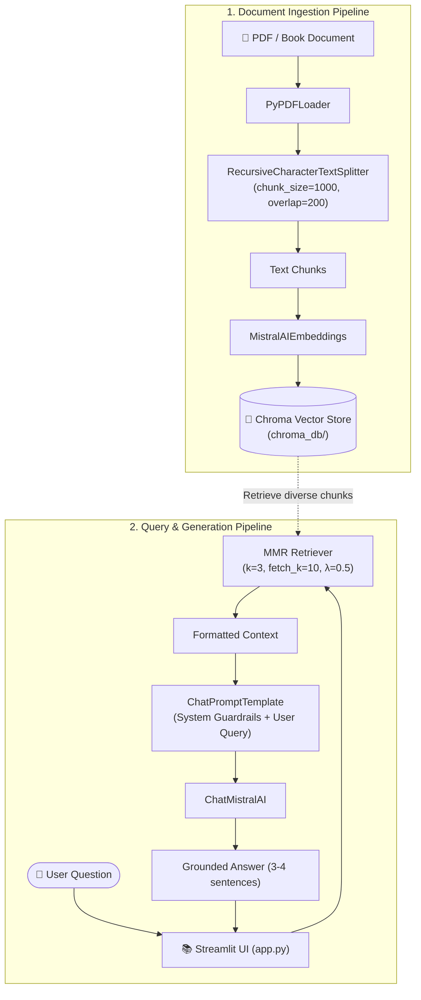

# 📚 Book & Document RAG Assistant

A robust, production-ready Retrieval-Augmented Generation (RAG) assistant built with **LangChain**, **ChromaDB**, **Mistral AI**, and **Streamlit**. This application indexes dense text documents and multi-page PDFs to deliver precise, context-grounded answers with zero hallucination.

[](https://www.python.org/)
[](https://python.langchain.com/)
[](https://mistral.ai/)
[](https://www.trychroma.com/)
[](https://streamlit.io/)
[](https://github.com/astral-sh/uv)
[](LICENSE)

---

## 📑 Table of Contents

- [📚 Book \& Document RAG Assistant](#-book--document-rag-assistant)
  - [📑 Table of Contents](#-table-of-contents)
  - [🌟 Overview](#-overview)
  - [🏗 Architecture \& Workflow](#-architecture--workflow)
  - [🚀 Key Features](#-key-features)
  - [📁 Project Structure](#-project-structure)
  - [⚙️ Prerequisites](#️-prerequisites)
  - [🛠 Getting Started](#-getting-started)
    - [1. Clone Repository](#1-clone-repository)
    - [2. Environment Setup](#2-environment-setup)
      - [Option A: Using `uv` (Recommended)](#option-a-using-uv-recommended)
      - [Option B: Using `pip` \& Python venv](#option-b-using-pip--python-venv)
    - [3. Configure Environment Variables](#3-configure-environment-variables)
  - [🖥 Running the Application](#-running-the-application)
    - [Step 1: Ingest Documents into ChromaDB](#step-1-ingest-documents-into-chromadb)
    - [Step 2: Launch Streamlit Chat Assistant](#step-2-launch-streamlit-chat-assistant)
  - [🔍 Core Technical Highlights](#-core-technical-highlights)
    - [1. Chunking Strategy](#1-chunking-strategy)
    - [2. MMR (Maximum Marginal Relevance) Search](#2-mmr-maximum-marginal-relevance-search)
  - [🗺 Upcoming Roadmap](#-upcoming-roadmap)
    - [📅 Phase 1: Interactive Upload \& Dynamic Ingestion *(Near Term)*](#-phase-1-interactive-upload--dynamic-ingestion-near-term)
    - [📅 Phase 2: Advanced Retrieval \& Re-ranking](#-phase-2-advanced-retrieval--re-ranking)
    - [📅 Phase 3: Conversational Memory \& Agentic RAG](#-phase-3-conversational-memory--agentic-rag)
    - [📅 Phase 4: Citation \& Verification Transparency](#-phase-4-citation--verification-transparency)
    - [📅 Phase 5: Multi-LLM Provider Selector](#-phase-5-multi-llm-provider-selector)
    - [📅 Phase 6: Production Hardening \& Deployment](#-phase-6-production-hardening--deployment)
  - [🤝 Contributing](#-contributing)
  - [📄 License](#-license)
  - [👤 Author](#-author)

---

## 🌟 Overview

Standard large language models frequently hallucinate or lack domain-specific information. **Book RAG Assistant** bridges this gap by decoupling knowledge retrieval from text generation:

1. **Ingestion**: Multi-page PDF documents (e.g., industry whitepapers, policy documents, books) are parsed, chunked, embedded, and stored locally in ChromaDB.
2. **Retrieval**: Uses **Maximum Marginal Relevance (MMR)** search to balance similarity against chunk redundancy, ensuring high informational diversity in the retrieved context.
3. **Generation**: Mistral AI processes the selected context and responds concisely (3–4 sentences), explicitly signaling when the answer is not present in the document.

---

## 🏗 Architecture & Workflow



---

## 🚀 Key Features

- **⚡ Fast Vector Indexing**: Seamless document loading using `PyPDFLoader` and `MistralAIEmbeddings`.
- **🎯 MMR Retrieval (Maximum Marginal Relevance)**: Avoids redundant context by balancing relevance (`k=3`) and diversity across an expanded pool (`fetch_k=10`).
- **🛡️ Anti-Hallucination Guardrails**: Prompt engineering instructs the model to refuse speculative answers if the source text lacks supporting information.
- **💬 Streamlit Conversational UI**: Interactive chat interface with persistent session memory and response loading spinners.
- **📂 Multi-Provider Extensible**: Pre-configured LangChain ecosystem support for Mistral AI, OpenAI, Google Gemini, and Groq.
- **🚀 Modern Tooling with `uv`**: Ultra-fast dependency resolution and virtual environment handling.

---

## 📁 Project Structure

```text
RAG_langchain_bot/
├── app.py                   # Streamlit web UI for interactive Q&A
├── main.py                  # Core RAG pipeline (retrieval + prompt + LLM)
├── create_database.py       # Document parsing, chunking, and ChromaDB persistence
├── pyproject.toml           # uv project configuration and dependencies
├── requirements.txt         # Standard pip dependency requirements
├── uv.lock                  # Lockfile ensuring reproducible environments
├── .env.example             # Template for API keys and environment variables
├── LICENSE                  # MIT Open Source License
├── README.md                # Project documentation
│
├── chroma_db/               # Local ChromaDB persistent storage (auto-generated)
├── documentloader/          # Document loading scripts & reference PDFs
│   ├── pdf.py               # TokenTextSplitter PDF test script
│   ├── txt.py               # Text file loader test script
│   └── *.pdf                # Sample reference books and reports
├── govt docs/               # Specialized domain documents (Ministry of Electronics & IT)
├── retrievers/              # Experimental retrieval scripts (MMR, ArXiv)
├── vector store/            # Vector store testing and prototyping
└── src/                     # Core package module
```

---

## ⚙️ Prerequisites

- **Python**: `>= 3.13`
- **Mistral AI API Key**: Sign up at [Mistral AI Console](https://console.mistral.ai/)
- **Package Manager**: [`uv`](https://github.com/astral-sh/uv) (recommended) or `pip`

---

## 🛠 Getting Started

### 1. Clone Repository

```bash
git clone https://github.com/Navamanidhassan/RAG_langchain_bot.git
cd RAG_langchain_bot
```

### 2. Environment Setup

#### Option A: Using `uv` (Recommended)

```bash
# Create virtual environment and install all dependencies
uv venv
uv sync
```

#### Option B: Using `pip` & Python venv

```bash
# On Windows:
python -m venv .venv
.venv\Scripts\activate

# On macOS/Linux:
python3 -m venv .venv
source .venv/bin/activate

# Install dependencies:
pip install -r requirements.txt
pip install streamlit chromadb
```

### 3. Configure Environment Variables

Copy `.env.example` to create your local `.env`:

```bash
# On Windows (PowerShell):
Copy-Item .env.example .env

# On Linux / macOS:
cp .env.example .env
```

Open `.env` and enter your Mistral AI API key:

```ini
MISTRAL_API_KEY="your_actual_mistral_api_key"

# Optional keys for additional providers
OPENAI_API_KEY="your_openai_key"
GOOGLE_API_KEY="your_google_gemini_key"
GROQ_API_KEY="your_groq_key"
```

---

## 🖥 Running the Application

### Step 1: Ingest Documents into ChromaDB

Before starting the chatbot, parse your document and create the persistent vector store:

```bash
# Run ingestion pipeline
python create_database.py
```

*Output:*
```text
Database created successfully.
Total pages: <page_count>
Total chunks: <chunk_count>
```

> **Note:** To index your own document, update the file path in `create_database.py`:
> ```python
> data = PyPDFLoader("path/to/your/document.pdf")
> ```

### Step 2: Launch Streamlit Chat Assistant

Run the web interface:

```bash
streamlit run app.py
```

Open your browser at `http://localhost:8501` to start asking questions about your ingested book or document.

---

## 🔍 Core Technical Highlights

### 1. Chunking Strategy
Documents are chunked using `RecursiveCharacterTextSplitter`:
```python
splitter = RecursiveCharacterTextSplitter(chunk_size=1000, chunk_overlap=200)
```
- **Chunk Size (1000)**: Keeps paragraphs semantically coherent.
- **Chunk Overlap (200)**: Prevents critical boundary sentences from being split across chunk transitions.

### 2. MMR (Maximum Marginal Relevance) Search
Unlike standard similarity search which can pull three copies of identical text, MMR optimizes for both relevance to the query and diversity among selected documents:
```python
retriever = vectorstore.as_retriever(
    search_type="mmr",
    search_kwargs={
        "k": 3,  # Final number of chunks passed to the LLM
        "fetch_k": 10,  # Candidate chunk pool to consider
        "lambda_mult": 0.5,  # Balance factor: 1.0 = pure similarity, 0.0 = maximal diversity
    },
)
```

---

## 🗺 Upcoming Roadmap

### 📅 Phase 1: Interactive Upload & Dynamic Ingestion *(Near Term)*
- [ ] Add direct drag-and-drop PDF uploader inside the Streamlit UI.
- [ ] Enable in-memory or on-the-fly vector indexing without restarting the application.
- [ ] Support multi-document simultaneous indexing with collection tags.

### 📅 Phase 2: Advanced Retrieval & Re-ranking
- [ ] Implement **Hybrid Search** (Dense Vector Embeddings + BM25 Keyword Search).
- [ ] Integrate **Rerankers** (Cohere Rerank / FlashRank) to elevate high-precision passages to top positions.
- [ ] Add metadata filtering (by chapter, section, page range, or author).

### 📅 Phase 3: Conversational Memory & Agentic RAG
- [ ] Introduce multi-turn conversational memory with contextual query rephrasing (Condense Question Chain).
- [ ] Migrate pipeline to **LangGraph** for multi-step reasoning, agentic tool usage, and web-fallback retrieval.

### 📅 Phase 4: Citation & Verification Transparency
- [ ] Display exact source citations (page number, chunk extract, similarity score) in expander widgets below each answer.
- [ ] Add text highlight viewer for direct PDF grounding verification.

### 📅 Phase 5: Multi-LLM Provider Selector
- [ ] UI dropdown toggle to switch on the fly between **Mistral**, **OpenAI (GPT-4o)**, **Google Gemini 1.5/2.0**, and **Groq (Llama 3)**.
- [ ] Allow users to provide their own API keys directly via sidebar settings.

### 📅 Phase 6: Production Hardening & Deployment
- [ ] Comprehensive RAG evaluation suite using **Ragas** (Faithfulness, Answer Relevance, Context Recall).
- [ ] Docker containerization (`Dockerfile` and `docker-compose.yml`).
- [ ] Deployment guide for Hugging Face Spaces and Streamlit Community Cloud.

---

## 🤝 Contributing

> 🌱 **"Let's learn, build, and grow together!"**  
> Whether you're fixing a typo, improving documentation, refining prompt templates, or testing cutting-edge retrieval techniques — every contribution is warmly welcomed. No idea is too small!

To get started:

1. **Fork** the repository.
2. **Create** your feature branch:
   ```bash
   git checkout -b feature/AmazingFeature
   ```
3. **Commit** your changes:
   ```bash
   git commit -m "feat: Add amazing new feature"
   ```
4. **Push** to the branch:
   ```bash
   git push origin feature/AmazingFeature
   ```
5. **Open** a Pull Request.

💡 *Have a suggestion or found a bug? Feel free to open an [Issue](https://github.com/Navamanidhassan/RAG_langchain_bot/issues) and join the discussion!*

---

## 📄 License

This project is licensed under the **MIT License** — see the [LICENSE](LICENSE) file for complete details.

<details>
<summary>Click to view the full <b>MIT License</b> text</summary>

```text
MIT License

Copyright (c) 2026 Navamanidhassan

Permission is hereby granted, free of charge, to any person obtaining a copy
of this software and associated documentation files (the "Software"), to deal
in the Software without restriction, including without limitation the rights
to use, copy, modify, merge, publish, distribute, sublicense, and/or sell
copies of the Software, and to permit persons to whom the Software is
furnished to do so, subject to the following conditions:

The above copyright notice and this permission notice shall be included in all
copies or substantial portions of the Software.

THE SOFTWARE IS PROVIDED "AS IS", WITHOUT WARRANTY OF ANY KIND, EXPRESS OR
IMPLIED, INCLUDING BUT NOT LIMITED TO THE WARRANTIES OF MERCHANTABILITY,
FITNESS FOR A PARTICULAR PURPOSE AND NONINFRINGEMENT. IN NO EVENT SHALL THE
AUTHORS OR COPYRIGHT HOLDERS BE LIABLE FOR ANY CLAIM, DAMAGES OR OTHER
LIABILITY, WHETHER IN AN ACTION OF CONTRACT, TORT OR OTHERWISE, ARISING FROM,
OUT OF OR IN CONNECTION WITH THE SOFTWARE OR THE USE OR OTHER DEALINGS IN THE
SOFTWARE.
```

</details>

---

## 👤 Author

**Navamanidhassan**  
- **GitHub**: [@Navamanidhassan](https://github.com/Navamanidhassan)  
- **Repository**: [RAG_langchain_bot](https://github.com/Navamanidhassan/RAG_langchain_bot)  

*(Developed as part of the Generative AI exploration series)*

