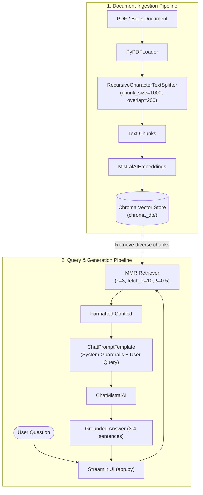

# Book & Document RAG Assistant

A Retrieval-Augmented Generation (RAG) assistant built with **LangChain**, **ChromaDB**, **Mistral AI**, and **Streamlit**. This application indexes dense text documents and multi-page PDFs to deliver precise, context-grounded answers while avoiding hallucinations.

[](https://www.python.org/)
[](https://python.langchain.com/)
[](https://mistral.ai/)
[](https://www.trychroma.com/)
[](https://streamlit.io/)
[](https://github.com/astral-sh/uv)
[](LICENSE)

---

## Table of Contents

- [Overview](#overview)
- [Application Preview](#application-preview)
- [Architecture & Workflow](#architecture--workflow)
- [Key Features](#key-features)
- [Project Structure](#project-structure)
- [Prerequisites](#prerequisites)
- [Getting Started](#getting-started)
  - [1. Clone Repository](#1-clone-repository)
  - [2. Environment Setup](#2-environment-setup)
  - [3. Install Dependencies](#3-install-dependencies)
  - [4. Configure Environment Variables](#4-configure-environment-variables)
- [Running the Application](#running-the-application)
  - [Step 1: Ingest Documents into ChromaDB](#step-1-ingest-documents-into-chromadb)
  - [Step 2: Launch Streamlit Chat Assistant](#step-2-launch-streamlit-chat-assistant)
- [Technical Highlights](#technical-highlights)
  - [1. Chunking Strategy](#1-chunking-strategy)
  - [2. MMR (Maximum Marginal Relevance) Search](#2-mmr-maximum-marginal-relevance-search)
- [Upcoming Roadmap](#upcoming-roadmap)
- [Contributing](#contributing)
- [License](#license)
- [Author](#author)

---

## Overview

Standard large language models frequently hallucinate or lack access to domain-specific documentation. This project provides a document-grounded Question & Answering system by decoupling knowledge retrieval from answer generation:

1. **Ingestion**: Multi-page PDF documents (e.g., reports, policy documents, books) are parsed, chunked, embedded, and stored locally in ChromaDB.
2. **Retrieval**: Uses **Maximum Marginal Relevance (MMR)** search to balance similarity against chunk redundancy, ensuring diverse informational context.
3. **Generation**: Mistral AI processes the selected context and responds concisely (3–4 sentences), explicitly acknowledging when the answer is not present in the document.

---

## Application Preview

<!-- Screenshot placeholder: Replace with your working screenshot from your laptop -->


---

## Architecture & Workflow



---

## Key Features

- **Fast Vector Indexing**: Document parsing and vector embedding generation using `PyPDFLoader` and `MistralAIEmbeddings`.
- **MMR Retrieval**: Reduces duplicate context passages by optimizing for both query relevance (`k=3`) and semantic diversity across a candidate pool (`fetch_k=10`).
- **Anti-Hallucination Guardrails**: System prompting instructs the model to refuse speculation when information is not present in the reference documents.
- **Streamlit Web UI**: Chat interface with session history management and response loading indicators.
- **Multi-Provider Architecture**: Built with LangChain components allowing straightforward extension to Mistral, OpenAI, Google Gemini, or Groq.
- **Package Management via uv**: Fast dependency resolution and reproducible virtual environments.

---

## Project Structure

```text
RAG_langchain_bot/
├── app.py                   # Streamlit web interface for chat Q&A
├── main.py                  # Core RAG pipeline (retrieval + prompt + LLM)
├── create_database.py       # Document parsing, chunking, and ChromaDB persistence
├── pyproject.toml           # uv project configuration and dependencies
├── requirements.txt         # Standard pip requirements
├── uv.lock                  # Lockfile for reproducible builds
├── .env.example             # Template for required environment variables
├── LICENSE                  # MIT License
├── README.md                # Project documentation
│
├── chroma_db/               # Local ChromaDB persistent storage (git-ignored)
├── docs/                    # Documentation assets
│   └── assets/              # Interface screenshots and diagrams
├── documentloader/          # Document loading scripts & sample PDFs
│   ├── pdf.py               # TokenTextSplitter reference script
│   ├── txt.py               # Plain text loader script
│   └── *.pdf                # Sample documents
├── govt docs/               # Specialized domain reference reports
├── retrievers/              # Retrieval experimentation scripts
├── vector store/            # Vector store testing and prototyping
└── src/                     # Core package module
```

---

## Prerequisites

- **Python**: `>= 3.13`
- **Mistral AI API Key**: Sign up at [Mistral AI Console](https://console.mistral.ai/)
- **Package Manager**: [`uv`](https://github.com/astral-sh/uv) (recommended) or `pip`

---

## Getting Started

### 1. Clone Repository

```bash
git clone https://github.com/Navamanidhassan/RAG_langchain_bot.git
cd RAG_langchain_bot
```

### 2. Environment Setup

#### Option A: Using `uv` (Recommended)

```bash
uv venv
uv sync
```

#### Option B: Using `pip` & Python venv

```bash
# On Windows:
python -m venv .venv
.venv\Scripts\activate

# On macOS/Linux:
python3 -m venv .venv
source .venv/bin/activate

# Install dependencies:
pip install -r requirements.txt
pip install streamlit chromadb
```

### 3. Configure Environment Variables

Copy `.env.example` to create your local `.env`:

```bash
# On Windows (PowerShell):
Copy-Item .env.example .env

# On Linux / macOS:
cp .env.example .env
```

Open `.env` and set your API key:

```ini
MISTRAL_API_KEY="your_actual_mistral_api_key"

# Optional keys for alternative providers
OPENAI_API_KEY="your_openai_key"
GOOGLE_API_KEY="your_google_gemini_key"
GROQ_API_KEY="your_groq_key"
```

---

## Running the Application

### Step 1: Ingest Documents into ChromaDB

Parse your document and generate the persistent vector database:

```bash
python create_database.py
```

Output:
```text
Database created successfully.
Total pages: <page_count>
Total chunks: <chunk_count>
```

> **Note:** To index your own document, update the target path in `create_database.py`:
> ```python
> data = PyPDFLoader("path/to/your/document.pdf")
> ```

### Step 2: Launch Streamlit Chat Assistant

Start the local web application:

```bash
streamlit run app.py
```

Access the interface at `http://localhost:8501`.

---

## Technical Highlights

### 1. Chunking Strategy
Documents are chunked using `RecursiveCharacterTextSplitter`:
```python
splitter = RecursiveCharacterTextSplitter(chunk_size=1000, chunk_overlap=200)
```
- **Chunk Size (1000)**: Keeps paragraphs and context semantically complete.
- **Chunk Overlap (200)**: Prevents sentences from being abruptly cut across chunk boundaries.

### 2. MMR (Maximum Marginal Relevance) Search
Standard similarity search can retrieve nearly identical passages. MMR retrieves relevant passages while penalizing redundancy:
```python
retriever = vectorstore.as_retriever(
    search_type="mmr",
    search_kwargs={
        "k": 3,  # Final chunks passed to the LLM
        "fetch_k": 10,  # Candidate pool to evaluate
        "lambda_mult": 0.5,  # 1.0 = pure similarity, 0.0 = maximal diversity
    },
)
```

---

## Upcoming Roadmap

### Phase 1: Interactive Upload & Dynamic Ingestion (Near Term)
- [ ] Add drag-and-drop PDF uploader directly in the Streamlit UI.
- [ ] Support on-the-fly vector indexing without restarting the app.
- [ ] Multi-document indexing with collection tags.

### Phase 2: Advanced Retrieval & Re-ranking
- [ ] Implement hybrid search (Dense Vector Embeddings + BM25 Keyword Search).
- [ ] Integrate rerankers (Cohere Rerank / FlashRank) for higher top-1 accuracy.
- [ ] Add metadata filtering by document title, chapter, or date.

### Phase 3: Conversational Memory & Agentic RAG
- [ ] Multi-turn chat memory with contextual query rephrasing.
- [ ] Migrate workflow to LangGraph for multi-step reasoning and fallback retrieval.

### Phase 4: Citation & Verification Transparency
- [ ] Display exact source citations (page number, chunk excerpt, similarity score) in expander widgets.
- [ ] Document highlight view for immediate source verification.

### Phase 5: Multi-LLM Provider Selector
- [ ] Sidebar toggle to switch between Mistral, OpenAI, Google Gemini, and Groq.
- [ ] Allow input of custom API keys through the web interface.

### Phase 6: Production Hardening & Deployment
- [ ] Automated evaluation pipeline using Ragas (Faithfulness, Answer Relevance).
- [ ] Containerization via Docker (`Dockerfile`, `docker-compose.yml`).
- [ ] Deployment guide for Streamlit Community Cloud and Hugging Face Spaces.

---

## Contributing

> *"Let's learn and grow together."*  
> Whether you are fixing a typo, improving documentation, refining prompt templates, or testing new retrieval techniques, contributions are welcome.

To get started:

1. **Fork** the repository.
2. **Create** your feature branch:
   ```bash
   git checkout -b feature/AmazingFeature
   ```
3. **Commit** your changes:
   ```bash
   git commit -m "feat: Add amazing new feature"
   ```
4. **Push** to the branch:
   ```bash
   git push origin feature/AmazingFeature
   ```
5. **Open** a Pull Request.

Have a suggestion or found a bug? Feel free to open an [Issue](https://github.com/Navamanidhassan/RAG_langchain_bot/issues).

---

## License

This project is licensed under the **MIT License** — see the [LICENSE](LICENSE) file for details.

<details>
<summary>Click to view the full MIT License text</summary>

```text
MIT License

Copyright (c) 2026 Navamanidhassan

Permission is hereby granted, free of charge, to any person obtaining a copy
of this software and associated documentation files (the "Software"), to deal
in the Software without restriction, including without limitation the rights
to use, copy, modify, merge, publish, distribute, sublicense, and/or sell
copies of the Software, and to permit persons to whom the Software is
furnished to do so, subject to the following conditions:

The above copyright notice and this permission notice shall be included in all
copies or substantial portions of the Software.

THE SOFTWARE IS PROVIDED "AS IS", WITHOUT WARRANTY OF ANY KIND, EXPRESS OR
IMPLIED, INCLUDING BUT NOT LIMITED TO THE WARRANTIES OF MERCHANTABILITY,
FITNESS FOR A PARTICULAR PURPOSE AND NONINFRINGEMENT. IN NO EVENT SHALL THE
AUTHORS OR COPYRIGHT HOLDERS BE LIABLE FOR ANY CLAIM, DAMAGES OR OTHER
LIABILITY, WHETHER IN AN ACTION OF CONTRACT, TORT OR OTHERWISE, ARISING FROM,
OUT OF OR IN CONNECTION WITH THE SOFTWARE OR THE USE OR OTHER DEALINGS IN THE
SOFTWARE.
```

</details>

---

## Author

**Navamanidhassan**  
- GitHub: [@Navamanidhassan](https://github.com/Navamanidhassan)  
- Repository: [RAG_langchain_bot](https://github.com/Navamanidhassan/RAG_langchain_bot)  

*(Developed as part of the Generative AI exploration series)*
